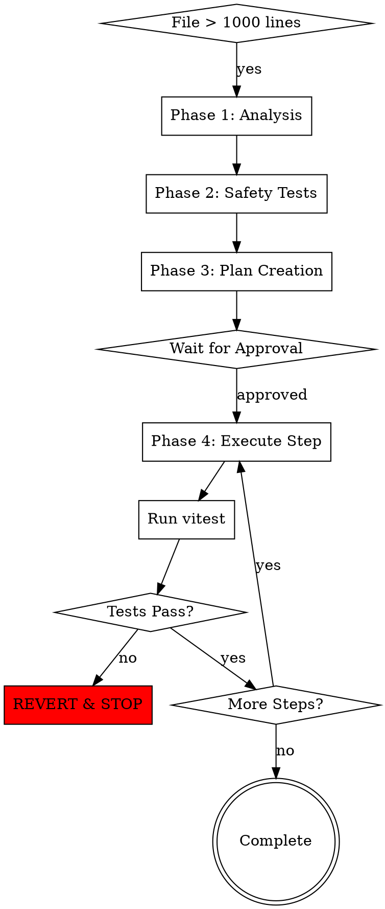
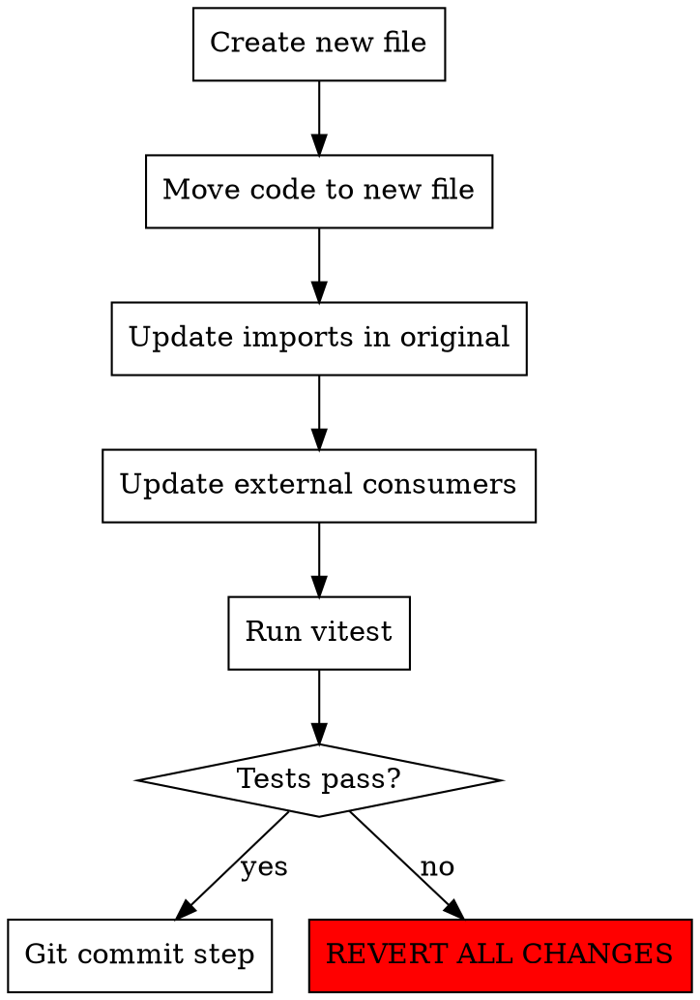

# Code Breakdown

## Required Rules

**CRITICAL: Before proceeding, load these project rules using the Skill tool:**
- `core-rules` - SRP, module size limits (400 lines), structure.md checks
- `file-splitting` - Extraction patterns and splitting methodology
- `typescript-rules` - Type safety requirements during refactoring

These rules define the quality standards that MUST be maintained during extraction.

## The Iron Rule

**Zero regression tolerance.** Every extraction must pass all existing tests. If tests fail, revert immediately and stop for human review.

## When to Use

Trigger this skill when:
- File exceeds 1000 lines
- User requests code breakdown/refactoring
- Proactive cleanup of oversized modules

## Workflow Overview



## Phase 1: Analysis

### Step 1.1: Measure Current State
```bash
# Count lines (excluding comments/blanks)
grep -v '^\s*$' file.ts | grep -v '^\s*//' | wc -l

# Identify logical sections
grep -n "^export\|^function\|^class\|^interface\|^type\|^const.*=" file.ts
```

### Step 1.2: Map Dependencies
```bash
# Find internal dependencies
grep -E "^import.*from '\./|^import.*from '\.\./" file.ts

# Find external consumers
grep -r "from '.*filename'" server/ --include="*.ts"
```

### Step 1.3: Identify Extraction Candidates

| Pattern | Extraction Type |
|---------|-----------------|
| Related functions (3+) | Utility module |
| Component sections | Sub-components |
| Type definitions (5+) | Types file |
| Constants block | Constants file |
| Class with helpers | Service + utils |
| Hook logic (50+ lines) | Custom hook |

## Phase 2: Generate Safety Tests

Before any extraction, ensure test coverage:

### Step 2.1: Check Existing Coverage
```bash
# Run existing tests
pnpm vitest run --coverage path/to/file.test.ts

# Check coverage percentage
# Target: 80%+ on functions being extracted
```

### Step 2.2: Generate Missing Tests

If coverage is insufficient:
```typescript
// Generate characterization tests
describe('ModuleName - Pre-refactor baseline', () => {
  // Test each public export
  // Test edge cases
  // Capture current behavior exactly
});
```

### Step 2.3: Verify All Tests Pass
```bash
pnpm vitest run
# ALL tests must pass before proceeding
```

## Phase 3: Create Extraction Plan

### Plan Structure
```markdown
# Extraction Plan: [filename]

## Current State
- Total lines: [X]
- Target: 200-300 lines per file
- Estimated new files: [N]

## Extraction Steps

### Step 1: [Description]
- Extract: [functions/types/constants]
- New file: [path/to/new-file.ts]
- Lines moved: ~[X]
- Dependencies affected: [list]

### Step 2: [Description]
...

## Risk Assessment
- High risk areas: [list]
- Rollback strategy: git revert per step

## Approval Required
[ ] I approve this extraction plan
```

### Plan Rules
- Maximum 3-4 new files per extraction session
- Each step must be independently testable
- Each step must be independently revertible
- Clear dependency mapping per step

## Phase 4: Execute Extraction

### Per-Step Process



### Step Execution Commands

```bash
# 1. Create extraction branch
git checkout -b refactor/breakdown-filename

# 2. After each step extraction
pnpm vitest run

# 3. If tests pass
git add -A && git commit -m "refactor: extract [description]"

# 4. If tests fail
git checkout -- .
git clean -fd
# STOP and report
```

### Atomic Commits

Each extraction step = one commit:
```
refactor: extract [module-name] from [original-file]

- Moved: [list of functions/types]
- New file: [path]
- Lines: [X] -> [Y] (original now [Z] lines)
- Tests: all passing
```

## Revert Protocol

When tests fail after extraction:

### Immediate Actions
1. **DO NOT** attempt to fix the test
2. **DO NOT** modify the extraction
3. Revert all uncommitted changes:
```bash
git checkout -- .
git clean -fd
```

### Report to User
```markdown
## Extraction Failed

**Step:** [N] - [description]
**Test failure:** [test name]
**Error:** [error message]

**Analysis:**
- Possible cause: [hypothesis]
- Affected code: [location]

**Recommendation:**
- [ ] Review test expectations
- [ ] Check for hidden dependencies
- [ ] Consider alternative extraction boundary
```

## Target File Sizes

| File Type | Target Lines | Max Lines |
|-----------|--------------|-----------|
| Components | 200 | 300 |
| Utilities | 150 | 200 |
| Services | 200 | 300 |
| Types | 150 | 200 |
| Hooks | 100 | 150 |

## Quick Reference

### Commands
```bash
# Analyze file
wc -l path/to/file.ts

# Find exports
grep -n "^export" path/to/file.ts

# Run tests
pnpm vitest run

# Revert changes
git checkout -- . && git clean -fd
```

### Red Flags - STOP
- Tests failing before extraction starts
- Circular dependency detected
- No clear extraction boundary
- External API contract would change

See `references/extraction-patterns.md` for patterns.
See `references/safety-testing.md` for test strategies.
See `references/plan-template.md` for plan format.
