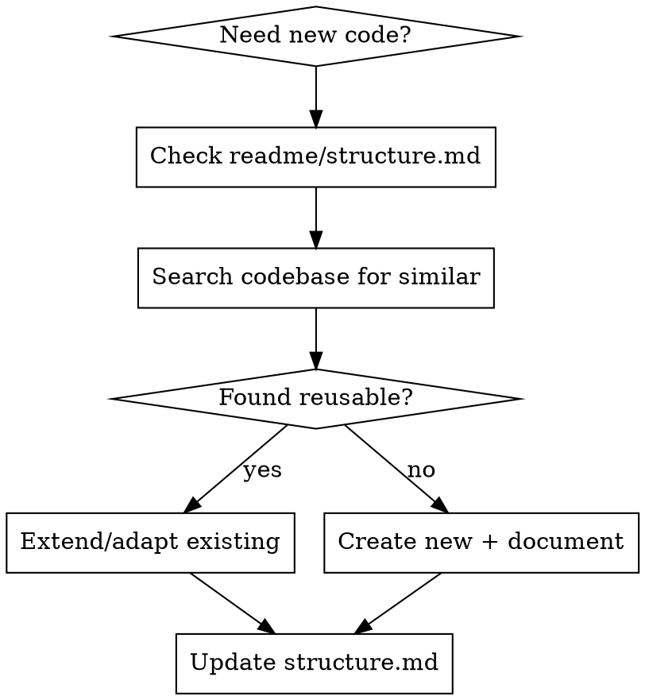
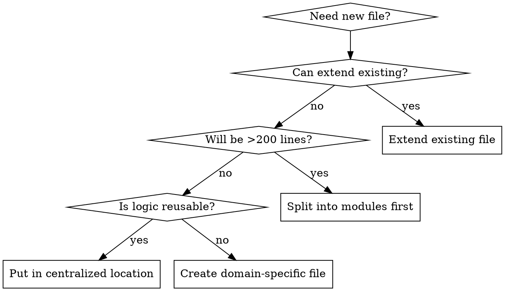

# Production Code Standards

## Required Rules

**CRITICAL: Before writing any code, load these project rules using the Skill tool:**
- `core-rules` - SRP, DRY, module size limits, structure.md registry
- `typescript-rules` - Type safety, no `any`, nullish coalescing
- `error-handling` - Error propagation, no eslint-disable, no ts-ignore
- `security-rules` - Credential handling, input validation, env var patterns

These rules are MANDATORY for all code in this project.

## The Iron Rule

**Best practice over "make it work".** Every line of code must be production-ready from the start.

## When to Use

Use this skill BEFORE:
- Creating any new file, function, or component
- Writing implementation code
- Refactoring existing code
- Making architectural decisions

## Core Standards

### 1. File Size Limits (Strict)

| Type | Max Lines | Action if Exceeded |
|------|-----------|-------------------|
| Components | 200 | Split immediately |
| Utilities/Helpers | 150 | Extract to modules |
| API Routes | 200 | Extract handlers |
| Services | 300 | Decompose by domain |
| Types/Interfaces | 200 | Group by domain |

**Exclusions from line count:** Comments, blank lines, import statements

### 2. Mandatory Reuse Analysis



**Before creating ANY new code:**
1. Check `readme/structure.md` for existing logic
2. Search: `grep -r "similar_pattern" server/`
3. Check `server/lib/` for utilities
4. Check `server/app/services/` for services
5. Check `client/` for shared components

### 3. Centralization Requirements

| What | Where | Why |
|------|-------|-----|
| API constants | `server/lib/constants.ts` | Single source of truth |
| Shared types | `server/app/types/` | Type consistency |
| Utilities | `server/lib/` | Prevent duplication |
| UI Components | `client/components/` | Reusability |
| Hooks | `server/app/hooks/` | Logic sharing |
| Services | `server/app/services/` | SDK/API wrappers |

### 4. Cost-Effective Implementation

**Choose the simplest solution that works:**

| Need | Cost-Effective | Over-Engineered |
|------|----------------|-----------------|
| State | React useState | Redux for 1 form |
| Fetch | Native fetch | axios for simple GET |
| Styling | TailwindCSS | CSS-in-JS libraries |
| Validation | Zod | Custom validator class |
| Date | Native Date | moment.js for formatting |

**Questions before adding dependency:**
1. Can native APIs solve this?
2. Is the bundle size justified?
3. Will this need maintenance?
4. Does existing code already handle this?

### 5. Production-Ready Checklist

Every piece of code MUST have:

- [ ] **Type Safety**: No `any`, use `unknown` + type guards
- [ ] **Error Handling**: Meaningful errors, proper propagation
- [ ] **Null Safety**: Use `??` not `||`, check before access
- [ ] **Input Validation**: Validate at boundaries
- [ ] **Consistent Naming**: Follow project conventions
- [ ] **No Magic Values**: Use constants
- [ ] **No Dead Code**: Remove unused imports/variables

## Red Flags - STOP Immediately

| Thought | Reality |
|---------|---------|
| "I'll refactor later" | Write it right the first time |
| "This is just a quick fix" | Quick fixes become tech debt |
| "Nobody will see this code" | All code gets maintained |
| "It works, ship it" | Working != production-ready |
| "I'll add types later" | Types prevent bugs now |
| "This file is getting long but..." | Split it NOW |
| "I need a new utility for this" | Did you check existing code? |

## File Creation Decision



## Quick Reference

### Naming Conventions

```typescript
// Files: kebab-case
user-profile.tsx
api-utils.ts

// Components: PascalCase
export function UserProfile() {}

// Functions: camelCase
export function getUserById() {}

// Constants: SCREAMING_SNAKE_CASE
export const API_BASE_URL = '/api/v1';

// Types/Interfaces: PascalCase
interface UserProfile {}
type ApiResponse<T> = {}
```

### Import Order

```typescript
// 1. React/Next.js
import { useState } from 'react';
import { useRouter } from 'next/navigation';

// 2. External libraries
import { z } from 'zod';

// 3. Internal absolute imports
import { Button } from '@/components/ui/button';
import { useAuth } from '@/hooks/use-auth';

// 4. Relative imports
import { localHelper } from './helpers';
```

## Common Mistakes

| Mistake | Fix |
|---------|-----|
| Creating new util when one exists | Search first, create last |
| 500+ line component | Extract sub-components |
| Inline magic numbers | Define constants |
| Optional chaining abuse | Validate data shape |
| Copy-paste between files | Extract shared logic |
| Hardcoded strings | Use i18n or constants |

## Enforcement

**Before PR/commit:**
1. Run `wc -l` on changed files
2. Verify no file exceeds limits
3. Check `readme/structure.md` is updated
4. Confirm no duplicate logic introduced

See `references/reuse-analysis.md` for detailed patterns.
See `references/file-organization.md` for splitting strategies.
